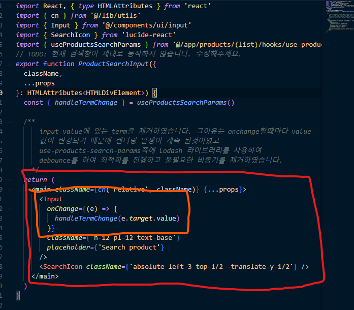

# 올라 프론트엔드 과제 - 올라 마켓 프로젝트 설명

search input을 입력할때 그리고 지울때 속도 저하가 발생하는 문제가 생겼습니다.
문제 해결 방식으로는 `첫째` input에 있는 value 값이
문제 이면서 이는 입력할때마다 value값이 변경되고
랜더링이 발생하는 문제가 생긴다는 것입니다.

`둘째` 디바운스를 사용하여 실시간 검색기능을 최적화하여 불필요한 쿼리를 남발하지
않는다는 초점에 맞췄습니다.
디바운스 같은 경우에는 lodash 라는 라이브러리를 사용하여 간편하게 작성하였습니다.


# 올라 프론트엔드 과제 안내

안녕하세요!
여러분의 관심과 지원에 감사드립니다. 본 문서에서는 **과제 전형**을 시작하기 위한 설정 방법을 설명해드리겠습니다.

## 🚀 프로젝트 설치

```bash
npm install -g pnpm # pnpm 설치 (설치되어 있지 않은 경우)
npm install -g nvm # nvm 설치 (설치되어 있지 않은 경우)

nvm install # nvmrc에 설정된 Node.js 버전 설치 및 사용

pnpm install # 의존성 설치

pnpm run dev # 개발 서버 실행
```

## 📝 과제 상세 설명

개발 서버 실행후 http://localhost:3000로 이동하여 과제를 확인해주세요.  

## 🙏 유의 사항

1. **외부 도움**을 받지 않고, **자체적으로** 문제를 해결해주세요.
2. 실행에 문제가 있거나 과제 관련 질문이 있다면 이슈를 만들어 내용을 작성하고 `sangmin4208` 계정을 태그해주세요. 확인 후 답변드리겠습니다.

---

## Acknowledgements

This project uses [DummyJSON API](https://github.com/Ovi/DummyJSON) to provide mock data.

### License

DummyJSON is licensed under the MIT License. See the [MIT License](https://opensource.org/licenses/MIT) for more details.
