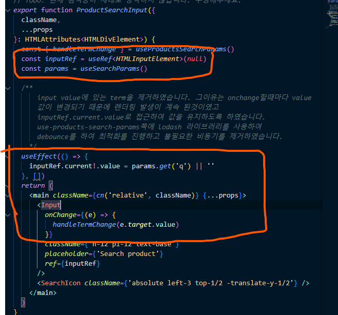

# 올라 프론트엔드 과제 - 올라 마켓 프로젝트 설명

`첫째` 파라미터를 useSearchParams로 접근하고 input 같은 경우는 value가
계속 변해서 렌더링 되기때문에 input의 ref로 접근하여 value 값을 변경해주었습니다.

`둘째` 디바운스를 사용하여 실시간 검색기능을 최적화하여 불필요한 쿼리를 남발하지
않는다는 초점에 맞췄습니다.
디바운스 같은 경우에는 lodash 라는 라이브러리를 사용하여 간편하게 작성하였습니다.

그리하여 문자열을 작성하고 나서 지울때 버벅거림을 개선하고 속도저하도 개선하였습니다.


## 상세페이지 


(첫번째화면은 PC,테블릿, 두번째 ~ 세번째화면은 모바일버전 입니다.)


댓글 쓴 사람을 나타내는 디자인은 유튜브 댓글 profile에서 영감을 얻어오고
backgroundColor 같은 경우에는 랜덤으로 선택되게 작성하였으며
댓글 작성 날짜 같은 경우도 보편적인 날짜 생성으로 나타나게 만들었습니다.


# 올라 프론트엔드 과제 안내

안녕하세요!
여러분의 관심과 지원에 감사드립니다. 본 문서에서는 **과제 전형**을 시작하기 위한 설정 방법을 설명해드리겠습니다.

## 🚀 프로젝트 설치

```bash
npm install -g pnpm # pnpm 설치 (설치되어 있지 않은 경우)
npm install -g nvm # nvm 설치 (설치되어 있지 않은 경우)

nvm install # nvmrc에 설정된 Node.js 버전 설치 및 사용

pnpm install # 의존성 설치

pnpm run dev # 개발 서버 실행
```

## 📝 과제 상세 설명

개발 서버 실행후 http://localhost:3000로 이동하여 과제를 확인해주세요.  

## 🙏 유의 사항

1. **외부 도움**을 받지 않고, **자체적으로** 문제를 해결해주세요.
2. 실행에 문제가 있거나 과제 관련 질문이 있다면 이슈를 만들어 내용을 작성하고 `sangmin4208` 계정을 태그해주세요. 확인 후 답변드리겠습니다.

---

## Acknowledgements

This project uses [DummyJSON API](https://github.com/Ovi/DummyJSON) to provide mock data.

### License

DummyJSON is licensed under the MIT License. See the [MIT License](https://opensource.org/licenses/MIT) for more details.
