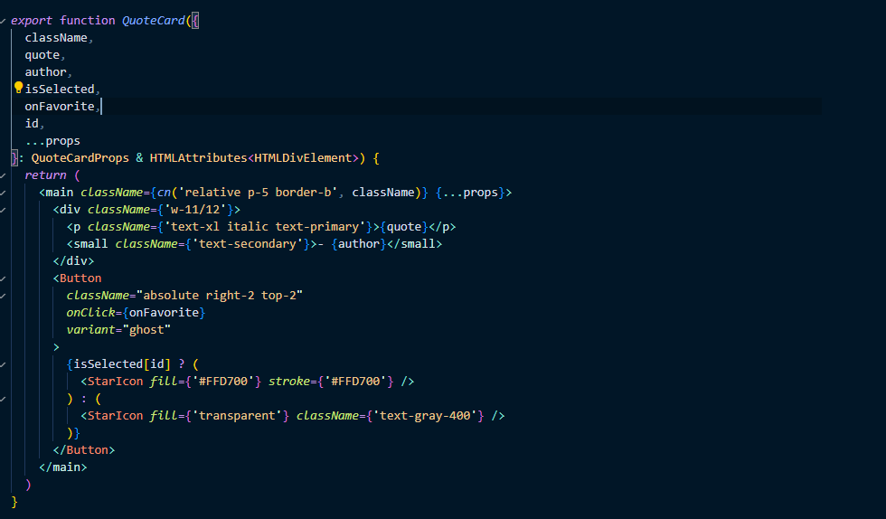

# 올라 프론트엔드 과제 - 올라 위즈덤 프로젝트


1. 무한스크롤 문제의도를 곰곰히 생각했을때 쓰로틀링을 이용하라는 의도로 파악했습니다. <br/>
   
2. 폴더를 따로 만들어 `quotes > hooks > use-infinite-quotes.ts` 만들어서<br/>
   tanstack query에 있는 `useInfiniteQuery`를 사용하고 처음 파라미터값을 0,<br/>
   그이후 30씩 skip에 더하는 식으로 진행하였습니다.
   
3. queryFn에 있는 getQuotes 같은 경우는 `actions > get-quotes > index.tsx`를 따로 만들어 
   <br/>
   서버와 통신하게 만들고 `schemas > quotes.ts` 생성하여 타입을 지정하였습니다.
   
4. `quotes > (list) > page.tsx` 에서 lodash 라이브러리에서 존재하는<br/>
   쓰로틀링을 사용하고 콜백함수를 스크롤에따라 사용자 화면에 맞추면서<br/>
   내릴때 fetchNextPage가 실행되게 만들었습니다.<br/>
   
   스크롤이벤트를 추가해주면서, `useInfiniteQuery`에서 데이터를 가져오는동안에는<br/>
   **Loading...** 나타나게 했습니다.

# 올라 프론트엔드 과제 - 올라 위즈덤 프로젝트 - 즐겨찾기 기능


1. 라이브러리 없이 localStorage로 제작하였습니다.<br/>
   
2. `isSelectedData`는 즐겨찾기를 추가하거나 삭제할 인용구 데이터 객체 배열을 담도록 하였습니다.<br/>
   `isSelected` 같은 경우는 사용자가 오른쪽에 있는<br/>
   별을 누를때 `ex) {1: false, 2: false } -> {1: true, 2: false}`<br/>
   키는 숫자 즉 사용자가 클릭한 아이템 id로 나타나게 만들고 on, off기능도 boolean형으로
   나타나게 하였습니다.<br/>
   
3. `selectItem` 함수는 두개 인자를 받습니다,<br/>
   하나는 **id**, 다른하나는 **{ id: number; quote: string; author: string }** <br/>
   `setIsSelectedData` 에서 배열안에 `{ id: number; quote: string; author: string }` 객체만 받는 배열 타입을 지정해놓습니다.<br/>
   `if (prev.find((item) => item.id === id))` 경우에는 이전 배열안에
   있는 객체 id 와 지금 클릭한 id가 같다면 filter 메소드를 이용하여
   id 다른 객체만 있는 배열을 반환하도록 하고,<br/>
   else 문은 spread 연산자로 이전것하고 현재것이 포함된
   배열을 반환하게 했습니다.<br/>
   
4. `isSelected` 의존성 배열에다가 놓은이유는 즐겨찾기를 클릭할때마다 때문입니다.<br/>
   localStorage에다가 각각 데이터와 클릭on, off를 저장해놓습니다.<br/>
   
5. `QuoteCard` 컴포넌트에는 **id**, **key** 를 설정해주고 <br/>

```js
onFavorite={() => {
                      setIsSelected((prev: { [key: number]: boolean }) => {
                        const result: { [key: number]: boolean } = {
                          ...prev,
                          [quote.id]: !isSelected[quote.id],
                        }
                        return result
                      })
                      selectItem(quote.id, quote)
                    }}
```
위 코드에서 클릭할때 객체에 선택했던 이전 값들과, 현재 선택한 값을 
**key - id** 값으로 표현, **value - 값이 존재하지 않기때문에 처음에는 undefined** 그렇기때문에 `처음 클릭하는 순간(별이 노란색) true로 변경되고 값을 저장`<br/>
`selectItem`을 호출할때 id, quote 값을 넘기도록 하였습니다.<br/>

6. `QuoteCard` 컴포넌트 파일에는 넘긴 `isSelected`에 넘긴 `id`를 사용하여
해당 프로퍼티값이 **true, false**로 판단하게 제작하였습니다.<br/>

7. `favorites > page.tsx` 같은경우도 현재 설명한 `quotes > (list) > page.tsx` 똑같이 위와 같은 방법으로 제작하였습니다.


# 올라 프론트엔드 과제 안내

안녕하세요!
여러분의 관심과 지원에 감사드립니다. 본 문서에서는 **과제 전형**을 시작하기 위한 설정 방법을 설명해드리겠습니다.

## 🚀 프로젝트 설치

```bash
npm install -g pnpm # pnpm 설치 (설치되어 있지 않은 경우)
npm install -g nvm # nvm 설치 (설치되어 있지 않은 경우)

nvm install # nvmrc에 설정된 Node.js 버전 설치 및 사용

pnpm install # 의존성 설치

pnpm run dev # 개발 서버 실행
```

## 📝 과제 상세 설명

개발 서버 실행후 http://localhost:3000로 이동하여 과제를 확인해주세요.

## 🙏 유의 사항

1. **외부 도움**을 받지 않고, **자체적으로** 문제를 해결해주세요.
2. 실행에 문제가 있거나 과제 관련 질문이 있다면 이슈를 만들어 내용을 작성하고 `sangmin4208` 계정을 태그해주세요. 확인 후 답변드리겠습니다.

---

## Acknowledgements

This project uses [DummyJSON API](https://github.com/Ovi/DummyJSON) to provide mock data.

### License

DummyJSON is licensed under the MIT License. See the [MIT License](https://opensource.org/licenses/MIT) for more details.
